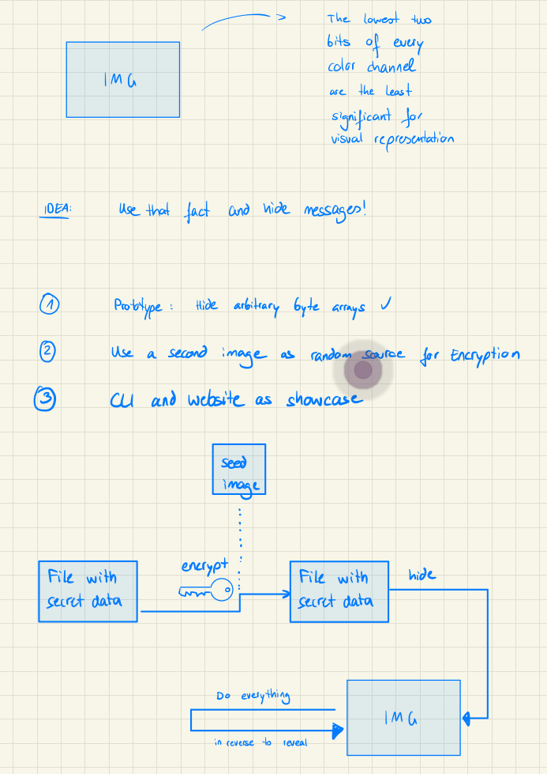

# Image Steganography

While taking a network security class at university (where i learned a lot about cryptography), there was this term mentioned - but never explained. That's how I came across it's Wikipedia article: [Steganography (Wikipedia)](https://en.wikipedia.org/wiki/Steganography).

I immediately liked the idea of hiding information inside of images in particular. And came up with a prototype in java. Small functional GUI, algorithm more complicated than necessary and only able to hide text. After a long break of development I came back to this project, with the goal to polish it a little more.

## Working live demo here 🚀: [Project Page](https://jthyroff.github.io/ImgSteg/)

Go to section "Live Demo" for explanation.

## Concept

The basic idea of this program is to hide information in images. Since the least significant bits per color channel are indeed not really significant for visual perception either, this can effectively be used as real storage capacity - making things possible that you never thought about before :D. Just hiding information in one image is rather boring - so we use another image as a encryption seed before storing the encrypted data in a second image. Spy movies 🕵️ are getting real! 

## Live Demo - [Project Page](https://jthyroff.github.io/ImgSteg/)

Nobody is going to clone java code, right? And steganograhy is not secure either - so i might as well build a web app. I made the effort to translate everything into javascript and programmed a minimum functional UI. Data is not stored and processed client-side.

### Challenge: Reveal the secret data 🔍! 

Do you see that folder called [Example_Images](./Example_Images/)? There is a picture of a beautiful sunrise that I took in the harbor of Tallinn. And it contains some secret data (I let you know that it's a txt file). Can you reveal it using the Live Demo? Hint: You will need to google "Sonnenblume" 🌻, go to the German wikipedia article and use the title image.

### Solution

1) Download the [sunrise image](./Example_Images/img_containing_secret_data.png) from the [Example_Images](./Example_Images/) folder.
2) Google "Sonnenblume". Go to the German Wikipedia article. Click on the title image. Right click -> Save Image as ...
(the folder [Example_Images](./Example_Images/) contains a copy of that image in case it changes in the future. You can use that as well).
3) Rename the file ending of the sonnenblume.jpg to *.png. Resulting in sonnenlume.png.
4) Go to the live demo.
5) Fill in the sunrise image as "input image" in the top left corner. Fill in sonnenblume.png as "seed image" in the top right.
6) Switch the toggle to "Reveal". The "input file" stays empty (For hiding only).
7) Hit the Process button. If everything goes fine (javascript has to be enabled), the secret data gets revealed and a download of the revealed file will be triggered. In order to open the file you have to change it's file ending to the original one. In our case rename it to *.txt. Resulting in decryptedFile_change_file_ending.txt instead of decryptedFile_change_file_ending.aaa. (on windows make sure that your file explorer displays file endings to be able to change them).
8) Open the file to see it's content! :D
9) Tell your friends and send hidden messages like a spy!

### Hide

Hiding a file works pretty similar. Choose an arbitrary small (< 70kB see Technical Note below) secret data file, Input Image and Seed Image. Fill in the fields in the UI and switch the toggle to Hide. Press "Process". The download should be triggered. The new image looks identical to the input image but contains the secret data now. You can pass this to a friend (uncompressed!) together with the information which seed image you used (sonnenblume.png in the upper example). The cool thing is that the actual data is only stored in the input image - the seed image is just used for revealing and can be any publicly available image from the internet!

### Security Note

*Steganography is never a replacement for cryptography. And it never even reaches similar security levels as cryptography.* This program is solely designed for educational and fun purposes. For this example implementation the information is only as secure as the information that the two selected images belong together (very little security).

### Technical Note

- The live demo doesn't catch any exceptions yet and is still a prototype. If no download is triggered something went wrong probably. (Check using the developer console). Make sure to understand the concept and retry.
- File sizes: The size of the secret file that should be hidden is limited by the size of the input image. The current implementation just utilizes the least significant bits of the R, G, B color channels: We can store 3 bit of information per pixel in the input image. The encryption with the seed image adds a constant initialization vector to the encrypted data as well (will be neglected for the following calculation): Thus for a full HD image (1920 x 1080 = 2073600 pixels) we can store files up to 2.073.600 \* 3 = 6.220.800 bit = 777.600 byte = 777,6 kB. For the provided [sunrise image](./Example_Images/img_containing_secret_data.png) (4032×3024 = 12.192.768 pixels) we can store files up to 12.192.768 \* 3 = 36.578.304 bit = 4.572.288 byte ~ 4.57 MB. (I didn't try that yet :D)
- Compression: Least significant bits can be changed during image compression. Thus the design choice of just working with \*.png images. PNG is a *lossless* image compression and thus suitable for the application. Attention: The common web image format \*.jpg is *lossy*!
- Encryption: The secret file is encrypted using AES-256 with the SHA-256 hash of the seed image as seed value (or "password"). The random initialization vector has to be stored in the input image along with the resulting encrypted data.
